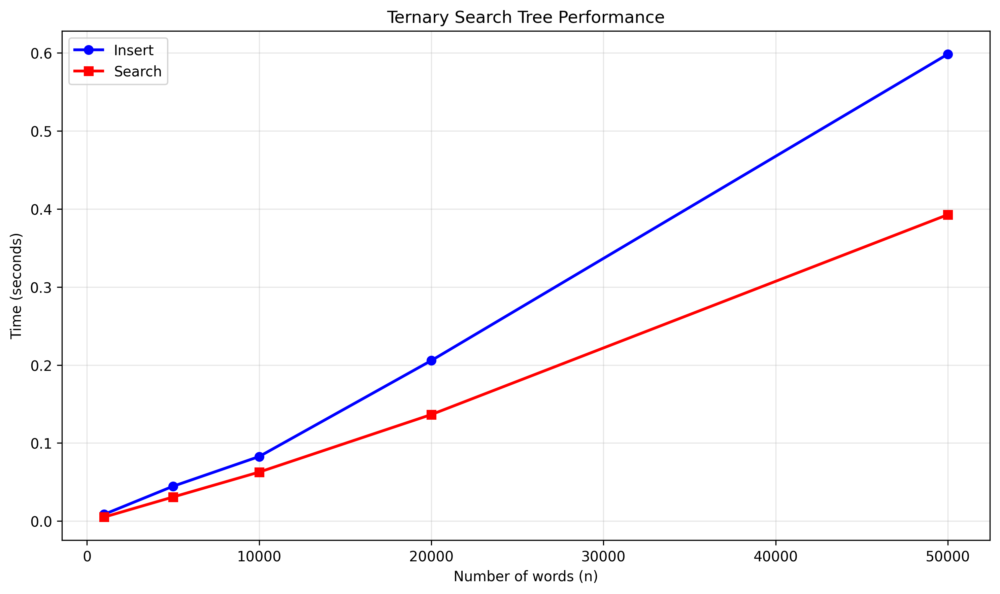

# Ternary Search Tree

A Python implementation of a Ternary Search Tree (TST) for efficient word storage and search.

## What is it?

A data structure that stores words efficiently and searches them quickly - like a smart dictionary.


## Installation

```bash
git clone https://github.com/banucicekkandemir/Ternary-Search-Tree-Implementation-and-Benchmarking/tree/main
cd Ternary-Search-Tree-Implementation-and-Benchmarking
```
## Usage

```python
from src.tst import TernarySearchTree

# Create tree and add words
tree = TernarySearchTree()
tree.insert("cat")
tree.insert("dog")
tree.insert("bird")

# Search for words
print(tree.search("cat"))     # True
print(tree.search("fish"))    # False

# Get all words (sorted)
print(tree.all_strings())     # ['bird', 'cat', 'dog']

# Count words
print(len(tree))              # 3

# String representation
print(str(tree))              # "bird, cat, dog"

# Load words from file
with open('data/insert_words.txt', 'r') as f:
    for line in f:
        word = line.strip()
        if word:
            tree.insert(word)
```
## Performance

### Time Complexity
| Operation | Time Complexity | Description |
|-----------|----------------|-------------|
| *Insert* | O(L) | L = length of word |
| *Search* | O(L) | L = length of word |
| *Get All Words* | O(N × L) | N = number of words, L = average word length |

### Space Complexity
- *Overall*: O(N × L) where N = number of unique words, L = average word length
- *Efficient*: Words sharing prefixes share nodes, reducing actual memory usage
- *Per Node*: Each node stores one character + 3 pointers + 1 boolean flag

## Best, Average, and Worst Case Scenarios

### Best Case: O(L)
When words are inserted in random order with well-distributed characters, the TST remains balanced. Each insertion and search takes O(L) time where L is the word length.

### Average Case: O(L) 
For typical datasets with diverse vocabulary and no extreme prefix overlap, performance stays close to the best case. Each operation takes O(L) time.

### Worst Case: O(L × h)
When words are inserted in sorted order or share very long common prefixes, the tree can become unbalanced with height h approaching N. In extreme cases, operations can take O(L × log N) to O(L × N) time, where the tree degrades toward a linked-list structure.

### Benchmark Results



*Figure: Performance comparison of insert and search operations with increasing dataset size*

### Benchmark Results Interpretation
As shown in our benchmark plot (see above), the total time for N insertions or searches increases linearly with N, confirming that the per-operation time remains roughly constant at O(L) for our data. This empirical result demonstrates that, under average-case conditions, our TST implementation performs as expected: each word insertion and search takes time proportional to the word length, independent of the overall dataset size.

## Files

- `src/tst.py` - Main code
- `tests/test_tst.py` - Tests
- `data/` - Sample word files

## Testing

```bash
# Run tests
pytest

```